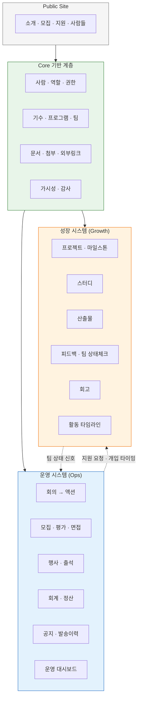
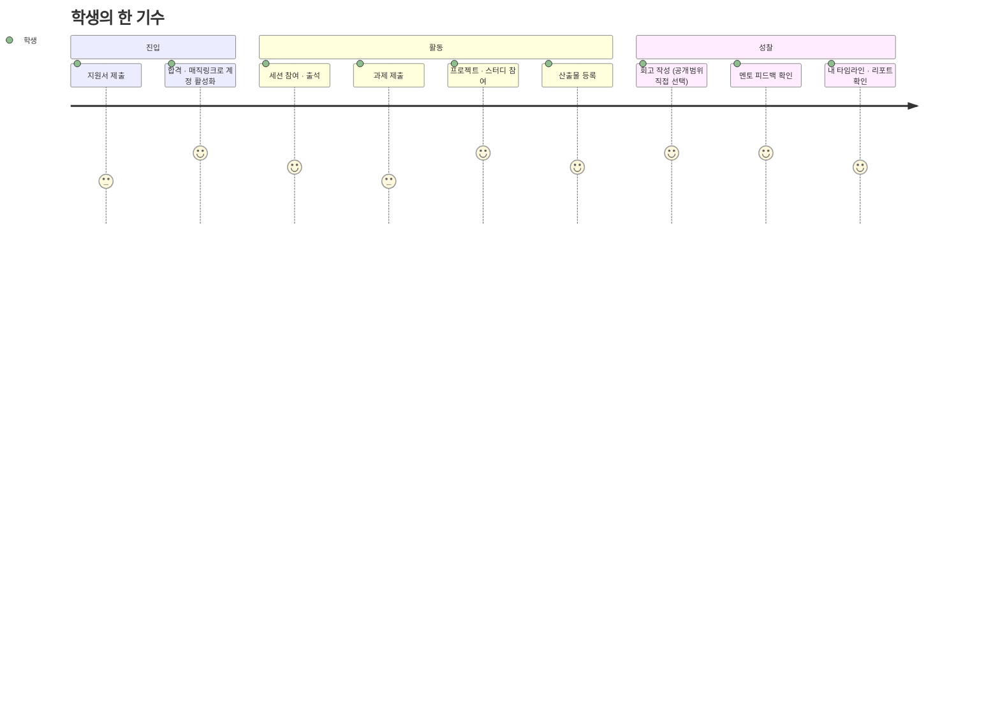
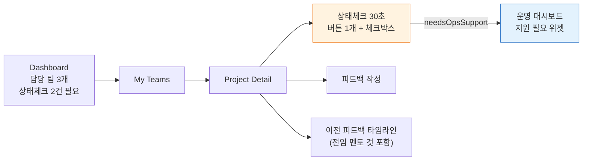
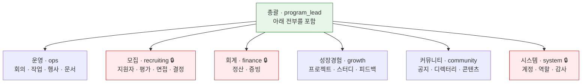
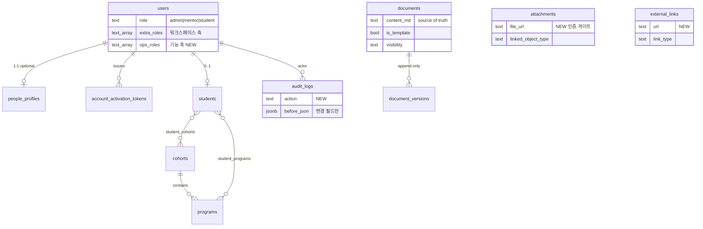
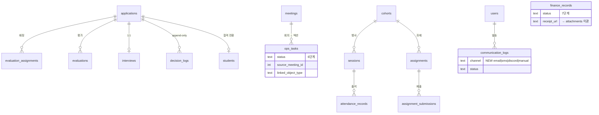
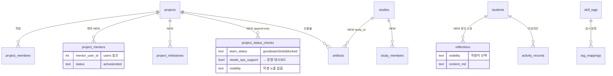
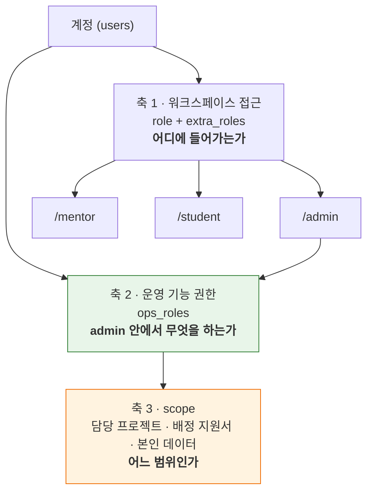
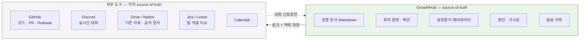
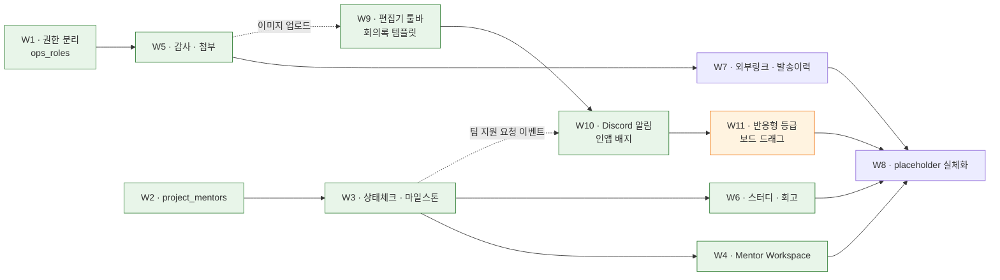

# 설계 00 — GrowthHub 완성 형상

> **전부 만들면 어떤 모습이 되는가.** 이 문서는 개별 명세(01~05)를 하나의 그림으로 합친 목표 상태다.
> 선행: [`../baseline/`](../baseline/) 11종 · [`../visibility-policy.md`](../visibility-policy.md)
> 하위: [01 권한](01-role-permissions.md) · [02 멘토](02-mentor-workspace.md) · [03 성장증거](03-growth-evidence.md) · [04 Core 인프라](04-core-infra.md) · [05 제품 경험](05-product-experience.md)

---

## 1. 한 장 요약

| 축 | 현재 | 완성 | 증가 |
|---|---:|---:|---:|
| 데이터 테이블 | **41** | **41** | — |
| 화면(라우트) | **81** | **81** | — |
| 빈 placeholder 화면 | **0** | **0** | — |
| 워크스페이스 | 4 | 4 | — |
| 운영진 기능 역할 | 7 | 7 | — |

> **2026-08-08 실측 갱신.** 이 표는 "현재 40테이블·69라우트·placeholder 8개"로 남아
> 있었으나 전부 낡은 값이었다. 실제로 센 값은 위와 같다 — 테이블 41(`lib/db/drizzle/
> 0000_fine_moonstone.sql`의 `CREATE TABLE` 41개), 라우트 81(`App.tsx`의 `<Route path=`
> 81개), placeholder 0. §7의 Wave 표도 같은 이유로 어긋나 있어 함께 고쳤다.
>
> `gap-register.md`가 경고한 드리프트가 설계 문서 안에서 재발한 자리다. 이 문서와
> [`README.md` §4](README.md)가 서로 다른 말을 하고 있었고, 실측하면 README 쪽이 맞았다.

**한 문장:** 운영진 7개 역할이 각자 필요한 것만 보면서 Seeds를 굴리고, 멘토는 담당 팀을 30초 만에 파악해 짧게 피드백하고, 학생은 자기 성장 흔적이 쌓이는 걸 스스로 본다 — 그리고 그 어느 것도 점수가 되지 않는다.



Core는 Ops·Growth와 동급 하위 시스템이 아니라 **둘이 딛고 서는 바닥**이다. Ops와 Growth는 서로를 호출하지 않고 **신호만 주고받는다** — 팀 상태체크가 운영 대시보드에 뜨고, 운영진 지원이 팀으로 간다.

---

## 2. 완성 시 사용자 경험

### 2.1 학생



**완성 시 학생이 갖는 것**

| 화면 | 무엇을 보는가 |
|---|---|
| Dashboard | 이번 주 세션·마감 과제·새 피드백 |
| My Projects / My Studies | 참여 중인 팀, 마일스톤, 팀 산출물 |
| My Artifacts | 내가 만든 것 전부 — 포트폴리오의 원자료 |
| **My Reflections** | 내 회고. **공개 범위를 내가 정하고 언제든 되돌린다** |
| **My Feedback** | 나에게 공개된 피드백만 |
| My Timeline / Report | 활동 요약 — **평가가 아니라 기록** |

**학생이 절대 보지 않는 것:** 팀 상태체크(`risk`/`blocked` 판정), 운영진 회의록, 회계, 다른 학생의 `private` 산출물, 지원자 평가 결과.

### 2.2 멘토



**핵심은 입력 최소화다.** 멘토에게 요구하는 정기 입력은 상태체크 하나뿐이고, 필수 항목은 상태 버튼 4개 중 1개 + 지원필요 체크박스뿐이다. 나머지는 전부 선택.

담당 팀에 달린 피드백은 **작성자·유형·visibility 무관 전부** 보인다(ADR-004). 멘토가 교체돼도 맥락이 끊기지 않는다.

### 2.3 운영진 — 7개 역할



🔒 = **제한 열람.** 담당자 + 총괄만. 그 외 관리자 화면은 모든 운영진이 읽는다(운영 투명성 우선).

**완성 시 실제 장면**

> 새로 합류한 회계 담당이 `/admin`에 로그인한다. 사이드바에 **재정**은 보이지만 **모집**과 **감사 로그**는 아예 없다. 회의록·작업·행사·프로젝트는 다 읽을 수 있어서 지금 Seeds가 어떻게 돌아가는지 파악할 수 있다. 정산 화면에서 영수증을 열면 인증 게이트를 지나 서명된 파일이 뜬다. 그가 지원자 명단을 보려 URL을 직접 쳐도 403이다.

**운영 대시보드**가 이 역할들의 접점이다 — 지연 작업, 행사 준비율, 미정산, 평가 진행률, 갱신 필요 문서, 그리고 **팀 지원 필요**(멘토가 올린 신호).

### 2.4 지원자 / 외부

공개 사이트는 지금과 같다. 지원 → 서류 평가 → 면접 → 최종 결정 → 매직링크 활성화 흐름이 그대로 유지되고, 각 단계 발송 이력이 `communication_logs`에 남는다.

---

## 3. 전체 IA

범례: ✅ 구현됨 · 🟡 설계 완료(미구현) · ⬜ 빈 placeholder(실체화 필요) · ❌ 만들지 않음

### 3.1 Public Site — 12 화면, 전부 완성

```text
✅ / · /about · /program · /faq · /recruit
✅ /apply · /apply/success
✅ /people · /people/:kind/:id  (레거시 /mentors · /staff · /members)
✅ /login · /admin/login · /student/login
✅ /activate/:token
```

### 3.2 Admin Workspace

```text
Home
  ✅ /admin                          대시보드

Core · 코어
  ✅ /admin/users                    사용자 + 기능 역할 편집
  ✅ /admin/people                   사람들 프로필
  ✅ /admin/roles                    역할 & 권한 개요
  ✅ /admin/cohorts                  기수
  ✅ /admin/programs                 프로그램
  ❌ /admin/members                  ← W8에서 제거 결정 (/admin/users + /admin/people 로 충분)

Ops · 운영
  ✅ /admin/meetings[/:id]           회의록 → 액션 생성
  ✅ /admin/tasks                    운영 작업 칸반
  ✅ /admin/documents[/:id]          Markdown 문서 + 버전 + 템플릿
  ✅ /admin/applications[/:id]       🔒 모집
  ✅ /admin/evaluators               평가 담당자 풀
  ✅ /admin/interviews               🔒 면접 일정 통합 뷰
  ✅ /admin/sessions[/:id][/attendance]  행사/세션
  ✅ /admin/attendance               출석 집계
  ✅ /admin/assignments[/:id]        학생 과제
  ✅ /admin/announcements            공지
  ✅ /admin/finance                  🔒 회계
  ✅ /admin/ops-dashboard            운영 대시보드
  ✅ /admin/communications           🔒 발송 이력 (recruiting/community)

Growth · 성장
  ✅ /admin/students[/:id][/timeline][/report]
  ✅ /admin/projects[/:id]           + 담당 멘토 · 마일스톤 · 상태체크 이력
  ✅ /admin/studies                  스터디
  ✅ /admin/team-status              전체 팀 상태 보드
  ✅ /admin/activity-records
  ✅ /admin/artifacts
  ✅ /admin/feedback
  ❌ /admin/reflections              ← 만들지 않음 · placeholder 제거 완료 (§3.6)
  ✅ /admin/tags                     임시 분류 태그
  ✅ /admin/reports                  리포트 인덱스

Content · 콘텐츠
  ✅ /admin/site-content
  ❌ /admin/public-pages             ← W8에서 제거 결정 (/admin/site-content 가 담당)
  ✅ /admin/media                    첨부 + 외부링크 통합

System · 시스템
  ❌ /admin/integrations             ← W8에서 제거 결정 (/admin/media 가 담당)
  ✅ /admin/audit-logs               🔒 감사 로그
  ❌ /admin/settings                 ← W8에서 제거 결정 (설정 대상이 아직 없다)
```

### 3.3 Mentor Workspace — 현재 2 → 완성 7

```text
✅ /mentor                  Dashboard (담당 팀 요약으로 보완)
✅ /mentor/teams            My Teams
✅ /mentor/projects/:id     Project Detail + 상태체크 + 피드백
✅ /mentor/feedback         내 피드백 이력
✅ /evaluator[/applications/:id]   평가 표면 (별개 축)
✅ /mentor/profile
✅ /people                  디렉터리
```

### 3.4 Student Workspace — 현재 10 → 완성 14

```text
✅ /student                     Dashboard
✅ /student/sessions · /attendance · /assignments[/:id] · /announcements
✅ /student/projects[/:id] · /artifacts · /timeline · /report · /profile
✅ /student/studies[/:id]       My Studies
✅ /student/reflections         My Reflections (공개범위 선택)
✅ /student/feedback            My Feedback
🟡 /student/team-meetings/:id   팀 회의록 작성·수정 (설계 06)
```

### 3.5 Evaluation Surface — 완성

역할이 아니라 **배정 기반 표면**이다. `requireAdminOrMentor` + 지원서 단위 소유권 재확인. `recruiting` 기능 역할과 **독립** — 배정받은 멘토는 기능 역할 없이 평가한다.

### 3.6 만들지 않기로 한 화면

| 화면 | 이유 |
|---|---|
| `/admin/reflections` | **ADR-001.** 운영진 회고 일괄 조회 경로를 만들지 않는 것이 "회고는 평가에 쓰이지 않는다"의 구조적 보장이다. **W6에서 nav placeholder를 제거 완료** — 이제 코드에 회고 관련 admin 경로가 존재하지 않는다 |
| 학생용 팀 상태 화면 | 팀이 `risk`로 표시된 것을 학생이 보면 신호가 아니라 낙인이 된다 |
| 멘토 활동량 집계 | 감시로 읽힌다 |
| DOCX 내장 편집기 | Markdown이 source of truth |

---

## 4. 전체 데이터 모델 — 41 테이블

### 4.1 도메인 분포

| 도메인 | 현재 | 신규 | 완성 |
|---|---:|---:|---:|
| Core (사용자·기수·문서·인프라) | 14 | +3 | 17 |
| Ops (모집·행사·회계·공지) | 10 | +1 | 11 |
| Growth (프로젝트·성장증거) | 7 | +6 | 13 |
| **합계** | **31** | **+10** | **41** |

### 4.2 Core



신규 3: `audit_logs`, `attachments`, `external_links`.

### 4.3 Ops



신규 1: `communication_logs`.

### 4.4 Growth



신규 6: `project_mentors`, `project_milestones`, `project_status_checks`, `studies`, `study_members`, `reflections`.

### 4.5 완성 후에도 만들지 않는 테이블

| 테이블 | 판단 |
|---|---|
| `role_assignments` | 보류. `ops_roles`는 scope가 없어 "3기 담당 회계"를 표현 못 한다. 그 요구가 실제로 생기면 도입 |
| `calendar_events` | 범위 제외. `sessions` + `ops_tasks.dueDate`가 이미 그 역할 |
| `teams` | `projects` + `project_members` 조합으로 충분 |
| `event_checklists` | `documents`(체크리스트 문서)를 세션에 연결해 흡수 |
| `sync_logs` / `integration_accounts` | 링크 기반 연동 유지. API 연동 확정 시 |

---

## 5. 권한 최종 형상

### 5.1 2축 모델



**접근 = 워크스페이스 AND 기능역할 AND scope AND visibility.** 네 관문 전부를 통과해야 한다.

### 5.2 최종 접근 매트릭스

| 데이터 | 비로그인 | 학생 | 멘토(담당) | 멘토(비담당) | 운영진 일반 | 담당 기능역할 | 총괄 |
|---|---|---|---|---|---|---|---|
| 공개 프로필 | 일부 | ✅ | ✅ | ✅ | ✅ | ✅ | ✅ |
| 본인 활동·산출물 | — | ✅ | — | — | ✅ | ✅ | ✅ |
| 팀 산출물 | — | 팀·기수 공개분 | ≠`private` | — | ✅ | ✅ | ✅ |
| 피드백 | — | 본인 공개분 | **담당 팀 전체** | — | ✅ | ✅ | ✅ |
| 회고 | — | 본인 전부 | 학생 공개 시 | — | `cohort_visible`만 | 동일 | 동일 |
| 팀 상태체크 | — | **—** | ✅ | — | ✅ | ✅ | ✅ |
| 회의록·문서 | — | — | `mentor_visible` | `mentor_visible` | ✅ | ✅ | ✅ |
| 운영 작업 | — | — | — | — | ✅ | ✅ | ✅ |
| 회계 | — | — | — | — | **—** | `finance` | ✅ |
| 지원자·평가 | — | — | 배정분 | 배정분 | **—** | `recruiting` | ✅ |
| 감사 로그 | — | — | — | — | **—** | `system` | ✅ |

**굵은 `—` 3개가 이 설계의 핵심**이다. 운영진이라고 다 보지 않는다.

---

## 6. 시스템 경계



**GrowthHub는 외부 도구를 대체하지 않는다.** 링크와 메타데이터, 그리고 "이게 왜 여기 붙어 있는지"라는 맥락만 관리한다.

> **2026-08-08 — 문서 축은 예외가 되었다 ([ADR-010](06-team-meeting-notes.md)).**
> Notion을 도입하지 않기로 하면서 **팀 회의록의 source of truth가 GrowthHub 안으로** 들어온다
> (`team_meetings`). 위 그림에서 Notion을 빼고 읽어야 한다.
>
> 경계 전체가 뒤집힌 것은 아니다 — GitHub(코드)·Discord(대화)·Drive(파일)는 그대로 밖이고,
> 링크로만 붙는다. 다만 그 링크를 이제 **학생도 직접 걸 수 있다**(설계 06 §7). 전에는 운영진만
> 가능해서, "링크만 관리한다"는 설계가 정작 링크 걸 사람을 운영진으로 한정하고 있었다.

점선이 **한 방향인 것이 중요하다** — 외부에서 들어오는 것은 대화 신호이지 판정 근거가 아니다. 커밋 수로 기여도를 매기지 않고, Discord 메시지 수로 참여도를 재지 않는다.

---

## 7. 완성까지 남은 작업



**W1~W11 전부 완료.** 세 축(권한/인프라 · 멘토/성장 · 제품 경험)이 대체로 독립이라 병렬로 진행됐다. 점선은 약한 의존이다.

남은 것은 Wave가 아니라 **미결 항목(§9)과 의도적 경계(§8)**뿐이다. 다만 "구현 완료"가 "검증 완료"는 아니다 — W11은 브라우저 실측이 남았고, W5는 첨부 다운로드가 응답을 보내지 않는 채로 "완료"로 표시돼 있었다(2026-08-08 수정). 수용 기준이 *막히는가*만 묻고 *뚫리는가*를 묻지 않으면 이런 것이 통과한다.

| Wave | 산출물 | 축 | 상태 |
|---|---|---|---|
| W1 | `ops_roles` + 게이트 + 백필 + 역할 UI | 권한 | ✅ 구현 완료 (DB push·런타임 검증 미완) |
| W2 | `project_mentors` + scope 헬퍼 + Admin 배정 UI | 성장 | ✅ 구현 완료 |
| W3 | `project_status_checks` · `project_milestones` · `projects` 확장 | 성장 | ✅ 구현 완료 |
| W4 | Mentor Workspace 4화면 | 성장 | ✅ 구현 완료 |
| W5 | `audit_logs` · `attachments` + 인증 게이트 다운로드 | 인프라 | ✅ 구현 완료 |
| W6 | `studies` · `study_members` · `reflections` + 학생 3화면 | 성장 | ✅ 구현 완료 |
| W7 | `external_links` (`communication_logs`는 W10에서 완료) | 인프라 | ✅ 구현 완료 (화면은 W8의 `/admin/media`) |
| W8 | placeholder 8개 → 실체화 4(미디어·면접·출석·리포트) / 제거 4(회원·공개페이지·외부연동·설정) | 마감 | ✅ 구현 완료 (라우트 실측 확인) |
| **W9** | `MarkdownEditor` 툴바 + 회의록 유형별 템플릿 + `bodyMd` 이관 | **경험** | ✅ 구현 완료 |
| **W10** | Discord 웹훅 + 인앱 배지 + 일일 요약 cron | **경험** | ✅ 구현 완료 |
| **W11** | 반응형 A/B/C 등급 + `DesktopOnly` 가드 + 작업 보드 드래그 | **경험** | ✅ 구현·검증 완료 (`e2e/run.mjs` 22 PASS) |

**병렬 가능:** 권한/인프라 축, 멘토/성장 축, 제품 경험 축이 서로 대체로 독립이다. W9의 이미지 붙여넣기만 W5에 의존한다.

**W10은 W3 이후가 자연스럽다** — 알릴 가장 중요한 이벤트(팀 지원 요청)가 W3에서 생긴다.

**즉시 가능한 것:** `/student/feedback`은 신규 테이블 없이 기존 `feedback` 필터만으로 만들 수 있다. 어느 Wave에든 끼워 넣을 수 있다.

---

## 8. 완성해도 하지 않는 것

이건 미완성이 아니라 **의도적 경계**다. baseline이 열어둔 것을 구현이 닫지 않는다.

| 영역 | 이유 |
|---|---|
| 학생 성장 점수 · 역량 정량평가 · 랭킹 | 성장모델 미확정. 확정 전 점수화는 방향을 잘못 고정한다 |
| 자동 성장 진단 · 자동 리포트 | 위와 동일 |
| GitHub 커밋 기반 기여도 판정 | 활동량은 대화 신호이지 평가가 아니다 |
| 커리큘럼 구조 확정 (`programs`의 최종 의미) | Parallel B 정렬 이후 |
| `skill_tags`의 최종 역량 체계 | 현재는 **임시 분류 태그** |
| Jira 대체 · 스프린트 관리 | 팀이 쓰는 도구를 뺏지 않는다 |
| ERP 수준 회계 | 동아리 규모에 과하다 |
| Discord 메시지 수집 · 활동량 추적 | 감시가 된다 |

이것들은 **Parallel B(성장모델·커리큘럼·운영모델 정렬)** 이후 Phase 4에서 다룬다. 그때 성장증거 계층이 성장해석 계층과 연결된다.

---

## 9. 미결 항목

완성 형상에서도 아직 답하지 않은 것들이다.

| 항목 | 언제 결정 |
|---|---|
| `/admin/reflections` placeholder를 제거할지, 정책 안내 페이지로 바꿀지 | W8 이전 |
| `programs`를 Curriculum Module / Track / Program 중 무엇으로 재정의할지 | Parallel B |
| 알럼나이 접근 범위 | 알럼나이 기능 검토 시 |
| 졸업·기수 종료 후 가시성 변화 (아카이브 정책) | Phase 4 |
| 학생이 자기 산출물을 외부 공개(포트폴리오)할 수 있는가 | Parallel B 이후 |
| `attachments` 서명 URL 만료 정책 | Object Storage 확장 시 |
| 운영진 담당 범위(scope) 표현이 필요해지는 시점 | 실제 요구 발생 시 |
