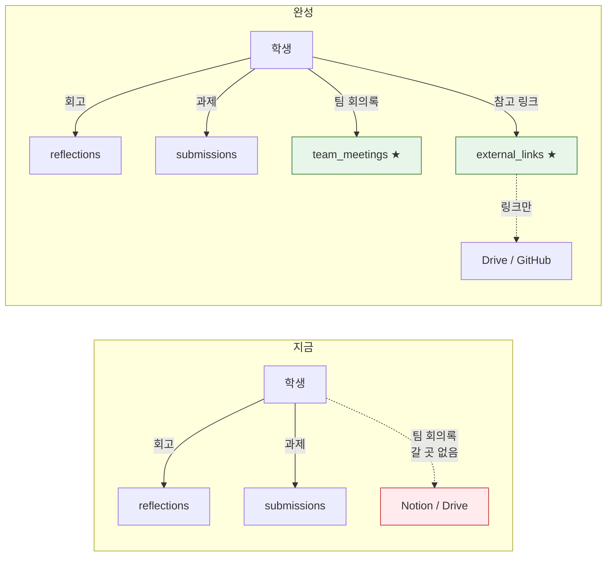
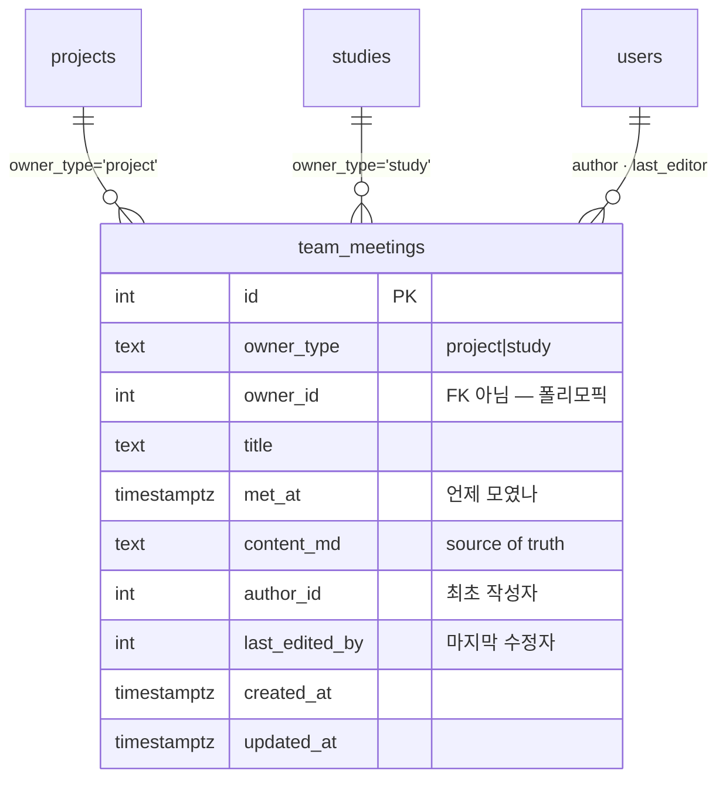

# 설계 06 — 팀 회의록 · 팀 참고링크

> **학생이 쓰는 첫 번째 협업 문서.** 팀이 모여서 정한 것을 팀 안에 남기고, 멘토와 운영진이 그걸 읽는다.
> 선행: [`../visibility-policy.md`](../visibility-policy.md) · [03 성장증거](03-growth-evidence.md) · [04 Core 인프라](04-core-infra.md)
> 상위: [00 완성 형상](00-target-state.md)

---

## 1. 왜 필요한가

지금 학생이 **쓸 수 있는 것은 정확히 두 가지**다. 코드로 확인한 결과다:

| 무엇 | 엔드포인트 |
|---|---|
| 회고 | `POST/PATCH/DELETE /student/reflections` |
| 과제 제출 | `POST /student/assignments/:id/submission` |

끝이다. 팀이 매주 모여서 무엇을 정했는지 남길 곳이 GrowthHub 안에 없다.

기존 `meetings`는 **운영진 회의록**이고 `documents`는 **운영 문서**다. 둘 다 스키마 주석에 "Students NEVER see" / "NEVER exposed to students"가 박혀 있고, 실제로 학생 라우트에 `meeting`이라는 단어가 한 번도 나오지 않는다.

그래서 지금 팀 회의록은 갈 곳이 Notion·Drive밖에 없었다. **그 전제가 바뀐다** (ADR-010).



★ = 이 문서가 다루는 것. `external_links`는 신규가 아니라 **학생 쓰기 경로만** 추가한다(§7).

---

## 2. 결정 기록

### ADR-009 — 팀 회의록은 `meetings`가 아니라 별도 테이블

**결정.** `team_meetings`를 새로 만든다. `meetings` 확장도, `documents` 재사용도 하지 않는다.

**근거.** 세 가지다.

1. **`meetings`는 "학생이 절대 못 본다"가 정체성이다.** visibility enum이 `admin_only | mentor_visible` 둘뿐이고, 그 전제 위에 라우트가 짜여 있다. 거기에 학생 값을 추가하면 그 전제에 기댄 모든 경로를 재검토해야 한다.

2. **`admin-meetings.ts`의 목록 조회에 visibility 필터가 없다.** 운영진 화면은 전부 반환한다. 같은 테이블에 팀 회의록을 넣으면 운영진 회의 목록에 팀 회의록이 쏟아지고, 지금 필터를 넣으면 기존 동작이 바뀐다. 어느 쪽도 좋지 않다.

3. **소유자·독자·수명이 다르다.** 운영진 회의록은 운영진이 쓰고 기수를 넘어 남는다. 팀 회의록은 팀이 쓰고 팀과 함께 끝난다. 한 테이블에 섞으면 실수 한 번에 운영진 회의록이 학생에게 새거나 그 반대가 된다.

**대가.** 회의록 유사 개념이 둘이 된다. 나중에 "회의록 전체 검색"을 만들면 두 테이블을 봐야 한다.

**영향.** §3 데이터 모델, §5 접근.

### ADR-010 — 팀 문서는 GrowthHub 안에 둔다 (시스템 경계 축소)

**결정.** 팀 회의록의 source of truth를 GrowthHub로 옮긴다. Notion은 쓰지 않는다.

**근거.** [00 §6](00-target-state.md)은 "GrowthHub는 외부 도구를 대체하지 않는다"며 Notion을 "기존 자료·공식 문서"의 source of truth로 뒀다. 운영 방침이 바뀌었다 — Notion을 도입하지 않기로 했으므로, 팀 회의록을 밖에 두면 **아무 데도 없게 된다.**

경계 전체를 뒤집는 것은 아니다. GitHub(코드)·Discord(대화)·Drive(파일)는 그대로 밖에 있다. **문서 축만** 안으로 들인다. `documents`가 이미 "Markdown이 source of truth"라고 선언했으므로 방향은 일관된다.

**대가.** GrowthHub가 문서 편집기 품질에 책임을 지게 된다. 동시 편집·댓글·검색 기대치가 따라 올라간다. 지금은 그 중 어느 것도 없다(§9).

**영향.** [00 §6](00-target-state.md) 시스템 경계 그림, §7 외부 링크.

### ADR-011 — 팀 회의록에 `visibility` 컬럼을 두지 않는다

**결정.** 청중을 **팀원 + 담당 멘토 + 운영진 전체**로 고정한다. 작성자가 고르지 않는다.

**근거.** 회고(ADR-001)와 성격이 다르다. 회고는 **사적 성찰**이라 공개 범위가 본인 것이어야 하고, 그래서 운영진 일괄 조회 경로를 구조로 막았다. 팀 회의록은 **팀 운영 기록**이다 — 무엇을 정했는지는 팀 밖에서도 읽혀야 멘토가 맥락을 잡고 운영진이 개입 시점을 안다.

[`visibility-policy.md`](../visibility-policy.md) §4.2가 `attachments`에서 `team_visible`을 제거하며 세운 원칙을 따른다 — **읽는 쪽이 없는 enum 값은 두지 않는다.** 청중이 고정이면 컬럼이 없는 게 정직하다. 값이 있으면 언젠가 누가 그걸 필터로 쓸 거라고 기대하게 된다.

**대가.** "이건 팀 안에서만"이 안 된다. 그런 내용은 회고에 쓰거나, 애초에 회의록에 안 쓰게 된다.

**영향.** §5 접근 매트릭스. 되돌리려면 컬럼 추가 + 읽기 경로를 **같은 변경에서** 함께 넣는다.

---

## 3. 데이터 모델



**`owner_type` + `owner_id` 폴리모픽인 이유.** `project_id`/`study_id` 두 nullable 컬럼을 두면 "둘 다 채워진 행"과 "둘 다 빈 행"이 가능해진다. 이 리포는 이미 `attachments`·`external_links`에서 폴리모픽 + `linkTargetExists()` 검증 패턴을 쓰고 있다. 같은 패턴을 따른다 — DB FK 대신 **쓰기 시점에 부모 존재를 확인**한다.

**`visibility` 없음** — ADR-011.

**버전 테이블 없음.** `documents`에는 `document_versions`가 있지만 여기엔 두지 않는다. 팀원 누구나 고칠 수 있으므로 덮어쓰기 사고가 날 수 있는데, 그 빈도가 실제로 문제가 되는지 확인 전에 테이블부터 만들지 않는다. 대신 `last_edited_by` + `updated_at`으로 **누가 마지막에 건드렸는지**는 남긴다. 미결로 §9에 둔다.

---

## 4. 누가 쓰는가

| 역할 | 작성 | 수정 | 삭제 |
|---|---|---|---|
| 팀원 (project_members / study_members) | ✅ | ✅ 누구나 | ✅ 누구나 |
| 담당 멘토 | — | — | — |
| 운영진 | — | — | — |

**팀원 누구나 고친다.** 회의록은 돌아가며 쓰는 것이고, `project_members`에 권한 개념이 없어서 "팀장만"을 만들려면 역할 모델을 먼저 손봐야 한다. 지금 `role`은 자유 텍스트다.

**멘토·운영진은 읽기 전용이다.** 남의 팀 회의록을 고치는 건 이상하다. 부적절한 내용을 지워야 하는 상황은 실제로 생기면 그때 운영진 삭제 경로를 추가한다 — 지금 만들면 쓰지 않을 권한이 하나 늘 뿐이다.

---

## 5. 누가 읽는가

| | 비로그인 | 학생(팀원) | 학생(비팀원) | 담당 멘토 | 비담당 멘토 | 운영진 |
|---|---|---|---|---|---|---|
| 프로젝트 회의록 | — | ✅ | **—** | ✅ | — | ✅ |
| 스터디 회의록 | — | ✅ | **—** | — ※ | — | ✅ |

※ **스터디에는 멘토 개념이 없다.** `studies`에 `leader_student_id`만 있고 `study_mentors`가 없다. 스터디 회의록은 팀원 + 운영진이다. 스터디에 멘토를 붙이기로 하면 그때 확장한다.

**굵은 `—`가 핵심이다.** 같은 기수라도 남의 팀 회의록은 못 본다. `cohort_visible` 같은 넓은 청중을 주지 않는 이유는, 팀 회의록이 종종 "이 부분이 잘 안 되고 있다"를 담기 때문이다. 기수 전체에 공개되면 그런 문장이 사라진다.

**스코프 헬퍼는 기존 것을 쓴다** — 멘토는 `getMentorProjectIds()`([`lib/mentor-scope.ts`](../../artifacts/api-server/src/lib/mentor-scope.ts)), 학생은 `project_members`/`study_members` 멤버십 조회. 새 개념을 만들지 않는다.

---

## 6. API

```text
학생 (requireStudent + 멤버십 확인)
  GET    /student/team-meetings?ownerType=project&ownerId=:id
  POST   /student/team-meetings
  PATCH  /student/team-meetings/:id
  DELETE /student/team-meetings/:id

멘토 (requireMentor + getMentorProjectIds)
  GET    /mentor/team-meetings?projectId=:id

운영진 (requireAdmin)
  GET    /admin/team-meetings?ownerType=&ownerId=
```

**미들웨어 통과 후 핸들러에서 소유권을 다시 확인한다.** `evaluator` 표면이 쓰는 패턴이고, [`gap-register.md`](../gap-register.md) §4가 "미들웨어 통과 후 재확인 패턴이 신규 변경 시 누락될 수 있다"고 경고한 자리다. 라우트가 `requireStudent`를 통과했다는 것은 "학생이다"까지만 말해주지 "이 팀 사람이다"를 말해주지 않는다.

**남의 팀 회의록에는 403이 아니라 404를 준다.** `attachments`가 쓰는 규칙과 같다 — 403은 그 id에 실재하는 회의록이 있다는 것을 확인해 준다.

---

## 7. 팀 참고링크 — 학생 쓰기 경로

Drive·GitHub 링크를 팀이 직접 걸 수 있어야 한다. **신규 테이블이 아니다.** `external_links`에 이미 전부 있다:

| 이미 있는 것 | 값 |
|---|---|
| `linkType` (사용자가 말한 "태그") | `github_repo` `github_pr` `github_issue` `readme` `release` `demo` `deck` **`drive`** `notion` `discord` `figma` `issue_board` `blog` `other` |
| `visibility` | `private` / `team_visible` / `cohort_visible` / `admin_only` |
| 연결 대상 | `project` · `study` 포함 14종 |
| 학생 **읽기** 경로 | `GET /student/external-links` (`studentLinkFilter`로 멤버십 스코프) |
| 정책 | [`visibility-policy.md`](../visibility-policy.md) §5.1 — 학생 = "부모 멤버십 ∩ `team_visible`/`cohort_visible`" |

**빠진 것은 쓰기 경로 하나뿐이다.**

```text
POST   /student/external-links      자기가 멤버인 project/study 에만
PATCH  /student/external-links/:id  자기 팀 것만
DELETE /student/external-links/:id  자기 팀 것만
```

**학생은 `admin_only`와 `private`을 고를 수 없다.** `admin_only`는 자기가 못 읽는 것을 만드는 셈이고, `private`은 팀에 거는 링크로서 의미가 없다. 허용값은 `team_visible`(기본) · `cohort_visible` 둘이다.

`external_links.ts`의 파일 주석은 "Writes are ops-only... 학생 쓰기 경로를 둘 이유가 없다"고 적혀 있다. **그 판단이 뒤집힌다** — 주석도 같이 고친다. 남겨두면 다음 사람이 지금 코드를 보고 혼란스러워한다.

---

## 8. 화면

| 표면 | 무엇 |
|---|---|
| `/student/projects/:id` · `/student/studies/:id` | 회의록 목록 + 새로 쓰기 · 참고링크 목록 + 추가 |
| `/student/team-meetings/:id` | 회의록 상세 · `MarkdownEditor`로 편집 |
| `/mentor/projects/:id` | 담당 팀 회의록 (읽기) |
| `/admin/projects/:id` · `/admin/studies` | 회의록 (읽기) |

**편집기는 `MarkdownEditor`를 그대로 쓴다** (W9). 툴바가 있어서 마크다운을 몰라도 쓸 수 있고, 이미지 붙여넣기가 `attachments`로 간다.

> ⚠️ 이미지 붙여넣기는 `POST /admin/attachments`에 의존한다. **학생은 그 경로에 접근할 수 없다.** 학생 화면에서는 `uploadTarget`을 주지 않아 붙여넣기를 끄고, 학생 첨부 업로드는 §9의 미결로 남긴다.

---

## 9. 미결

| 항목 | 언제 |
|---|---|
| 팀원끼리 덮어쓰기 사고가 실제로 나는가 → `team_meeting_versions` 필요 여부 | 한 기수 굴려 보고 |
| 학생 첨부 업로드 (회의록에 이미지·파일) | `attachments`의 학생 소유 개념과 함께 — visibility-policy §4.2 주석이 이미 예고한 자리 |
| 스터디에 담당 멘토를 붙일 것인가 (`study_mentors`) | 스터디 실사용 확인 후 |
| 회의록 검색 (운영진 회의록과 팀 회의록 두 테이블) | 검색 요구가 실제로 생기면 |
| 회의록 템플릿 (운영진 회의록은 유형별 템플릿이 있다 — W9) | 팀이 빈 화면을 어려워하면 |
| 회의록 삭제를 감사 로그에 남길 것인가 (`AUDIT_ACTIONS`·`LinkableType` 확장 필요) | 실수 삭제가 실제로 생기면 |
