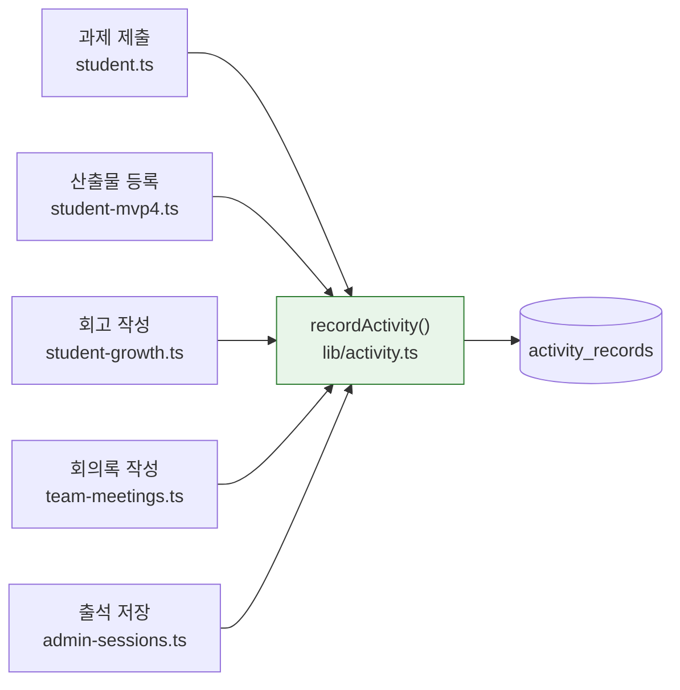

# 설계 07 — 활동 타임라인 자동 기록

> **학생이 한 일이 저절로 쌓이게 한다.** 지금은 운영진이 손으로 넣는 것 말고는 기록이 생기지 않는다.
> 선행: [`../visibility-policy.md`](../visibility-policy.md) · [00 §8 하지 않는 것](00-target-state.md)
> 관련: [03 성장증거](03-growth-evidence.md) · [06 팀 회의록](06-team-meeting-notes.md)

---

## 1. 왜 필요한가

`activity_records`에 행을 넣는 코드는 **운영진 수동 입력 라우트 하나뿐**이다. 출석해도, 과제를 내도, 산출물을 올려도 타임라인에는 아무것도 안 쌓인다.

그런데 이 테이블의 `sourceType`은 처음부터 이렇게 정의돼 있다:

```
session · assignment · project · feedback · manual
```

**`manual`이 예외로 설계된 것**인데 지금은 그것밖에 없다. 자동으로 채우라고 만든 구조가 비어 있는 셈이다.

결과는 두 겹이다.

1. 설계 00 §2.1이 학생에게 약속한 "**내 성장 흔적이 쌓이는 걸 스스로 본다**"가 빈 화면이다.
2. [baseline 05](../baseline/05-growth-v3.md)가 이 데이터를 "성장 해석의 원자료"로 규정했는데, Phase 4에서 성장모델을 붙일 때 **해석할 것이 없다.**

운영진이 학생마다 한 줄씩 타이핑해 줄 리 없다. 자동이 아니면 영원히 빈다.

---

## 2. 결정 기록

### ADR-013 — 기록하는 것은 "학생이 남긴 것"뿐

**결정.** 다음 다섯 가지에서만 자동 기록한다.

| 사건 | `sourceType` | 누가 남긴 것인가 |
|---|---|---|
| 과제 제출 | `assignment` | 학생 |
| 산출물 등록 | `project` | 학생 |
| 회고 작성 | `project` | 학생 |
| 팀 회의록 작성 | `project` | 학생 |
| 출석 기록 | `session` | 운영진이 찍지만 학생이 그 자리에 있었다 |

**기록하지 않는 것:**

| 안 하는 것 | 이유 |
|---|---|
| 로그인·화면 열람 | 활동이 아니라 접속이다. [00 §8](00-target-state.md)이 "Discord 메시지 수집·활동량 추적 → 감시가 된다"고 그은 선의 안쪽 |
| 조회수·체류시간 | 위와 동일 |
| 멘토가 남긴 피드백 | **학생이 한 일이 아니다.** 남이 나에 대해 쓴 것이 내 활동기록에 "내가 한 일"처럼 섞이면 안 된다. 피드백은 이미 `/student/feedback`에 있다 |
| 팀 상태체크 | 학생에게 노출하지 않는 판정이다([03 §2](03-growth-evidence.md)) |
| 수정·삭제 | 생성만 기록한다. 편집 이력은 타임라인이 답할 질문이 아니다 |

**근거.** 타임라인의 한 줄은 나중에 "이 학생이 무엇을 했는가"로 읽힌다. 그러니 **주어가 학생인 것만** 들어가야 한다. 접속 기록이 섞이면 그건 활동 기록이 아니라 접속 로그이고, 그 순간 감시 도구가 된다.

`sourceType`에 `feedback`이 있지만 **쓰지 않는다.** 열거값이 있다고 채워야 하는 것은 아니다.

**대가.** 타임라인이 학생의 활동 전부를 담지는 못한다. 담으려 하면 감시가 되므로 의도한 대가다.

### ADR-014 — 자동 기록은 실패해도 본래 동작을 막지 않는다

**결정.** 기록 삽입을 `try/catch`로 감싸고, 실패하면 로그만 남기고 원래 응답을 그대로 돌려준다.

**근거.** 과제 제출이 성공했는데 타임라인 한 줄을 못 써서 500이 나면 **학생은 제출을 잃는다.** 부차적 기록이 본체를 인질로 잡아서는 안 된다. `notifyDiscord`가 이미 같은 방침이다.

**대가.** 드물게 기록이 빠질 수 있다. 그 대신 본래 동작은 절대 안 깨진다.

### ADR-015 — 공개범위 기본값은 `student_visible`

**결정.** 자동 기록은 `student_visible`로 넣는다. `private`도 `admin_only`도 아니다.

**근거.** `/student/timeline`이 `student_visible`만 읽는다. `private`으로 넣으면 **본인도 못 보고**, 그러면 이 작업의 목적("학생이 스스로 본다")이 통째로 사라진다.

`admin_only`가 아닌 이유는, 이것이 학생 자신의 활동이라 학생에게 감출 근거가 없기 때문이다. 운영진 전용 기록이 필요하면 그건 수동(`manual`)으로 넣는다.

**영향.** [`visibility-policy.md`](../visibility-policy.md) `activity_records` 행.

---

## 3. 어떻게 붙이는가



**헬퍼 하나를 거친다.** 다섯 곳이 각자 insert 하면 `cohortId` 채우는 규칙과 실패 처리가 다섯 벌로 갈린다. `audit()`·`notifyDiscord()`가 이미 쓰는 모양을 따른다.

**`cohortId`는 필수(notNull)인데 사건마다 출처가 다르다.** 과제·모임은 그 객체가 기수를 알고, 산출물·회고·회의록은 학생의 기수를 봐야 한다. 헬퍼가 이 분기를 흡수하고, **기수를 못 찾으면 조용히 건너뛴다** — 기수 없는 학생의 활동은 어차피 어느 기수 리포트에도 실리지 않는다.

### 중복

출석은 한 모임에 여러 번 저장될 수 있다(운영진이 고쳐 넣는다). 매번 한 줄씩 쌓이면 타임라인이 같은 모임으로 도배된다. `(studentId, sourceType, sourceId)`가 같은 행이 이미 있으면 **새로 넣지 않는다.**

과제 제출도 같다 — 다시 제출하면 갱신이지 새 사건이 아니다.

---

## 4. 미결

| 항목 | 언제 |
|---|---|
| 이미 쌓인 과거 데이터의 소급 기록 | 실사용 후. 지금은 로컬 외에 데이터가 없다 |
| `skill_tags` 자동 부착 | 역량 체계가 확정된 뒤([00 §8](00-target-state.md)) |
| 스터디 활동의 `sourceType` | `project`로 뭉뚱그리고 있다. 스터디가 실제로 돌기 시작하면 나눌지 결정 |
| 타임라인에서 원본으로 가는 링크 | `sourceId`는 저장하고 있으나 화면이 아직 안 쓴다 |
